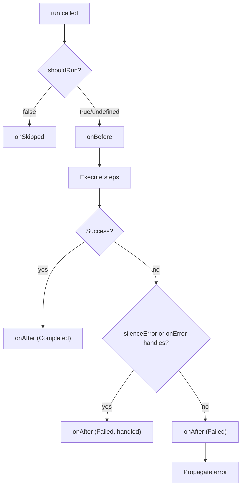
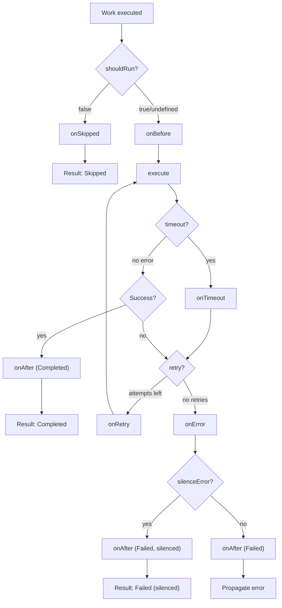

# @yigitahmetsahin/work-tree

A simple, extensible TypeScript workflow engine supporting serial and parallel work execution with full type inference.

[](https://www.npmjs.com/package/@yigitahmetsahin/work-tree)
[](https://www.npmjs.com/package/@yigitahmetsahin/work-tree)
[](https://github.com/yigitahmetsahin/work-tree/actions/workflows/ci.yml)
[](https://opensource.org/licenses/MIT)
[](https://www.typescriptlang.org/)
[](https://nodejs.org/)

## Features

- 🌳 **Tree-Based Workflows** - Build workflows as composable tree structures
- 🔄 **Serial & Parallel Execution** - Chain work items sequentially or run them concurrently
- 🎯 **Full Type Inference** - Work names and result types are automatically inferred
- 🧩 **Composable Trees** - Nest trees inside trees for complex workflows
- ⏭️ **Conditional Execution** - Skip work items based on runtime conditions
- 🛡️ **Error Handling** - Built-in error callbacks and silenceError option
- 🔄 **Retry Mechanism** - Configurable retries with exponential backoff
- ⏱️ **Timeout Support** - Set execution time limits with customizable callbacks
- 📊 **Execution Tracking** - Duration tracking for individual works and total workflow
- 🪶 **Zero Dependencies** - Lightweight with no external runtime dependencies

## Installation

```bash
npm install @yigitahmetsahin/work-tree
```

```bash
yarn add @yigitahmetsahin/work-tree
```

```bash
pnpm add @yigitahmetsahin/work-tree
```

## Quick Start

```typescript
import { Work, WorkStatus } from '@yigitahmetsahin/work-tree';

// Build a tree with serial and parallel steps
const tree = Work.tree('userDashboard')
  .addSerial({
    name: 'validate',
    execute: async (ctx) => ctx.data.userId.length > 0,
  })
  .addParallel([
    {
      name: 'fetchOrders',
      execute: async () => [{ id: 1 }, { id: 2 }],
    },
    {
      name: 'fetchProfile',
      execute: async () => ({ name: 'John', email: 'john@example.com' }),
    },
  ])
  .addSerial({
    name: 'process',
    execute: async (ctx) => {
      // ✅ Types are automatically inferred!
      // workResults.get() returns WorkResult with status, result, duration
      const orders = ctx.workResults.get('fetchOrders').result;
      const profile = ctx.workResults.get('fetchProfile').result;
      return { orderCount: orders?.length ?? 0, userName: profile?.name };
    },
  });

// Run the tree
const result = await tree.run({ userId: 'user-123' });

if (result.status === WorkStatus.Completed) {
  console.log('Tree completed in', result.totalDuration, 'ms');
  console.log('Final result:', result.context.workResults.get('process').result);
}
```

## API Reference

### `Work.tree(name, options?)`

Build a new tree work with a builder API for adding serial and parallel steps.

```typescript
// Simple tree
const tree = Work.tree('myTree');

// With options
const tree = Work.tree('myTree', {
  failFast: true, // optional: stop on first error (default: true)
  shouldRun: (ctx) => true, // optional: skip entire tree
  onBefore: (ctx) => {}, // optional: called before steps execute
  onAfter: (ctx, outcome) => {}, // optional: called after completion
  onError: (error, ctx) => {}, // optional: handle tree-level errors
  onSkipped: (ctx) => {}, // optional: called when tree is skipped
  silenceError: false, // optional: continue on error
});

// With typed data
interface UserData {
  userId: string;
}
const typedTree = Work.tree<UserData>('myTree').addSerial({
  name: 'step1',
  execute: async (ctx) => ctx.data.userId, // ✅ ctx.data is typed as UserData
});
```

### `.addSerial(work)`

Add a work to execute sequentially. Works added with `addSerial` run one after another.

```typescript
tree
  .addSerial({
    name: 'step1',
    execute: async (ctx) => 'result1',
  })
  .addSerial({
    name: 'step2',
    execute: async (ctx) => {
      // Access previous step's result
      const prev = ctx.workResults.get('step1').result; // 'result1'
      return 'result2';
    },
  });
```

### `.addParallel([works])`

Add multiple works to execute concurrently. All works in the array run simultaneously.

```typescript
tree.addParallel([
  { name: 'parallel1', execute: async () => 'a' },
  { name: 'parallel2', execute: async () => 'b' },
  { name: 'parallel3', execute: async () => 'c' },
]);
```

### `.run(data)`

Execute the tree with the given data.

```typescript
const result = await tree.run({ userId: '123' });

// Result structure
result.status; // WorkStatus.Completed | WorkStatus.Failed
result.totalDuration; // number (ms)
result.error; // Error | undefined
result.context.data; // { userId: '123' }
result.context.workResults.get('step1'); // WorkResult
```

### `.seal(finalWork?)`

Seal the tree to prevent modifications. Optionally add a final work.

```typescript
// Simple seal - prevents addSerial/addParallel
const sealed = tree.seal();
// sealed.addSerial(...) // Error - method doesn't exist on sealed tree

// Seal with final work
const sealedWithFinal = tree.seal({
  name: 'finalize',
  execute: async (ctx) => {
    const prev = ctx.workResults.get('step1').result;
    return `Done: ${prev}`;
  },
});

// Sealed trees can still be run
const result = await sealed.run(data);
```

### `.isSealed()` / `.options`

Check tree state and access options.

```typescript
const tree = Work.tree('tree', { failFast: false });

tree.isSealed(); // false
tree.options; // { failFast: false }

tree.seal();
tree.isSealed(); // true
```

### Work Definition

Each work can have the following properties:

```typescript
{
  name: 'workName',              // Required: unique name
  execute: async (ctx) => {},    // Required: async function
  shouldRun: (ctx) => true,      // Optional: skip condition
  onBefore: (ctx) => {},         // Optional: called before execute (trees only)
  onAfter: (ctx, outcome) => {}, // Optional: called after completion (trees only)
  onError: (err, ctx) => {},     // Optional: error handler
  onSkipped: (ctx) => {},        // Optional: called when skipped
  silenceError: false,           // Optional: continue on error
  retry: 3,                      // Optional: retry configuration
  timeout: 5000,                 // Optional: timeout in ms
}
```

### `Work` Class

For reusable work definitions, use the `Work` class:

```typescript
const fetchUser = new Work({
  name: 'fetchUser',
  execute: async (ctx) => {
    return { id: ctx.data.userId, name: 'John' };
  },
});

// Use in any tree
const tree = Work.tree('tree').addSerial(fetchUser);
```

## Nested Trees

Trees can be nested inside other trees for complex workflows:

```typescript
// Inner tree
const fetchDataTree = Work.tree('fetchData').addParallel([
  { name: 'fetchOrders', execute: async () => ['order1', 'order2'] },
  { name: 'fetchProfile', execute: async () => ({ name: 'John' }) },
]);

// Outer tree containing inner tree
const mainTree = Work.tree('main')
  .addSerial({ name: 'validate', execute: async () => true })
  .addSerial(fetchDataTree) // ← Nest the inner tree
  .addSerial({
    name: 'process',
    execute: async (ctx) => {
      // Access inner tree's work results directly!
      const orders = ctx.workResults.get('fetchOrders').result;
      const profile = ctx.workResults.get('fetchProfile').result;
      return { orders, profile };
    },
  });

const result = await mainTree.run({});

// Inner work results include parent reference
result.workResults.get('fetchOrders')?.parent; // 'fetchData'
```

## Conditional Execution

Skip works based on runtime conditions:

```typescript
const tree = Work.tree('notifications')
  .addSerial({
    name: 'sendEmail',
    shouldRun: (ctx) => ctx.data.sendEmail,
    execute: async () => ({ sent: true }),
  })
  .addSerial({
    name: 'sendSms',
    shouldRun: (ctx) => ctx.data.sendSms,
    execute: async () => ({ sent: true }),
  });

// Only sendEmail executes
await tree.run({ sendEmail: true, sendSms: false });
```

### `onSkipped` Callback

Handle skipped works (when `shouldRun` returns false):

```typescript
tree.addSerial({
  name: 'optionalStep',
  shouldRun: (ctx) => ctx.data.enabled,
  execute: async () => 'result',
  onSkipped: async (ctx) => {
    console.log('Step was skipped for user:', ctx.data.userId);
    // Useful for logging, cleanup, or triggering alternative actions
  },
});
```

## Lifecycle Hooks

Both trees and individual works support `onBefore` and `onAfter` hooks for setup and cleanup operations.

### Tree Execution Flow



### Work Execution Flow



### `onBefore` Hook

Called after `shouldRun` passes but before any steps execute:

```typescript
const tree = Work.tree('workflow', {
  onBefore: async (ctx) => {
    console.log('Starting workflow for user:', ctx.data.userId);
    // Useful for logging, setup, acquiring resources, etc.
  },
}).addSerial({
  name: 'step1',
  execute: async () => 'result',
});
```

If `onBefore` throws an error, the tree fails immediately and steps are not executed:

```typescript
const tree = Work.tree('guarded', {
  onBefore: async (ctx) => {
    if (!ctx.data.hasPermission) {
      throw new Error('Permission denied');
    }
  },
}).addSerial({
  name: 'protectedStep',
  execute: async () => 'secret data',
});
```

### `onAfter` Hook

Called after all steps complete (whether success or failure):

```typescript
const tree = Work.tree('workflow', {
  onAfter: async (ctx, outcome) => {
    // outcome: { status, result?, error?, workResults }
    if (outcome.status === WorkStatus.Completed) {
      console.log('Workflow completed with result:', outcome.result);
    } else {
      console.log('Workflow failed with error:', outcome.error?.message);
    }
    // Access any work result via outcome.workResults
    const step1 = outcome.workResults.get('step1').result;
  },
}).addSerial({
  name: 'step1',
  execute: async () => 'result',
});
```

### `setOnAfter` Method (Full Type Inference)

For better type inference on `workResults`, use the `setOnAfter()` method after adding steps:

```typescript
const tree = Work.tree('workflow')
  .addSerial({ name: 'step1', execute: async () => 'hello' })
  .addSerial({ name: 'step2', execute: async () => 42 })
  .setOnAfter(async (ctx, outcome) => {
    // ✅ Full type inference for workResults!
    const step1 = outcome.workResults.get('step1').result; // string
    const step2 = outcome.workResults.get('step2').result; // number
    console.log(`Step1: ${step1}, Step2: ${step2}`);
  });
```

Important notes about `onAfter`:

- **Not called** when tree is skipped (via `shouldRun`)
- **Called** even when `onBefore` throws (try/finally semantics for safe cleanup)
- **Called** even when steps fail (with error in outcome)
- **Called** even when error is handled (via `silenceError` or `onError`)
- Errors thrown in `onAfter` are silently ignored (don't affect tree result)

This try/finally behavior makes `onAfter` safe for resource cleanup patterns like lock/unlock:

```typescript
const tree = Work.tree('withLock', {
  onBefore: async () => {
    await acquireLock();
    // Even if something throws after this, onAfter will be called
  },
  onAfter: async () => {
    await releaseLock(); // Always called for cleanup
  },
});
```

### Combining Hooks

Use both hooks together for complete lifecycle management:

```typescript
const tree = Work.tree('transactional', {
  onBefore: async (ctx) => {
    console.log('Starting transaction...');
    ctx.data.transaction = await startTransaction();
  },
  onAfter: async (ctx, outcome) => {
    if (outcome.status === WorkStatus.Completed) {
      await ctx.data.transaction.commit();
      console.log('Transaction committed');
    } else {
      await ctx.data.transaction.rollback();
      console.log('Transaction rolled back');
    }
  },
})
  .addSerial({ name: 'step1', execute: async () => 'a' })
  .addSerial({ name: 'step2', execute: async () => 'b' });
```

### Nested Tree Hooks

Each nested tree has its own hooks that are called during its execution:

```typescript
const innerTree = Work.tree('inner', {
  onBefore: async () => console.log('Inner starting'),
  onAfter: async () => console.log('Inner done'),
}).addSerial({ name: 'innerStep', execute: async () => 'x' });

const outerTree = Work.tree('outer', {
  onBefore: async () => console.log('Outer starting'),
  onAfter: async () => console.log('Outer done'),
}).addSerial(innerTree);

// Output order: "Outer starting" → "Inner starting" → "Inner done" → "Outer done"
```

### Work-level Hooks

Individual `Work` instances also support `onBefore` and `onAfter` hooks:

```typescript
const workWithHooks = new Work({
  name: 'workWithHooks',
  onBefore: async (ctx) => {
    console.log('Starting work...');
  },
  execute: async (ctx) => {
    return `Hello, ${ctx.data.name}!`;
  },
  onAfter: async (ctx, outcome) => {
    console.log(`Work finished with status: ${outcome.status}`);
    if (outcome.status === WorkStatus.Completed) {
      console.log('Result:', outcome.result);
    }
  },
});

// Use in a tree
const tree = Work.tree('myTree').addSerial(workWithHooks);
await tree.run({ name: 'World' });
```

Work-level hook behavior:

- `onBefore` is called after `shouldRun` passes, before `execute`
- `onAfter` is called after execution completes (success or failure)
- **Neither hook is called** when work is skipped (via `shouldRun` returning false)
- `onAfter` **is called** even when `onBefore` fails (try/finally semantics)
- Errors thrown in `onAfter` are silently ignored (don't affect work result)

## Error Handling

### `onError` Callback

Handle errors without stopping the tree:

```typescript
tree.addSerial({
  name: 'riskyOperation',
  execute: async () => {
    throw new Error('Something went wrong');
  },
  onError: async (error, ctx) => {
    console.error('Logged:', error.message);
    // Don't throw → tree continues
    // Throw → tree stops
  },
});
```

### `silenceError` Option

Continue execution even when work fails (no `onError` called):

```typescript
tree.addSerial({
  name: 'optionalStep',
  silenceError: true,
  execute: async () => {
    throw new Error('This error is silenced');
  },
});
```

### `failFast` Option

Control whether parallel execution stops on first error:

```typescript
// Default: failFast is true - stops on first error
const tree1 = Work.tree('tree'); // failFast: true

// With failFast: false - continues and collects all errors
const tree2 = Work.tree('tree', { failFast: false })
  .addParallel([
    {
      name: 'task1',
      execute: async () => {
        throw new Error('Error 1');
      },
    },
    { name: 'task2', execute: async () => 'success' },
    {
      name: 'task3',
      execute: async () => {
        throw new Error('Error 3');
      },
    },
  ])
  .addSerial({
    name: 'afterParallel',
    execute: async () => 'continued', // This runs even with errors above
  });

const result = await tree2.run({});
// result.status === WorkStatus.Completed
// Individual work statuses show which failed
```

### Checking Work Status

```typescript
const workResult = result.context.workResults.get('workName');

switch (workResult.status) {
  case WorkStatus.Completed:
    console.log('Result:', workResult.result);
    break;
  case WorkStatus.Failed:
    console.log('Error:', workResult.error);
    break;
  case WorkStatus.Skipped:
    console.log('Work was skipped');
    break;
}
```

## Retry Mechanism

Works can be configured to retry on failure with various strategies.

### Simple Retry Count

```typescript
tree.addSerial({
  name: 'unreliableApi',
  execute: async () => {
    const response = await fetch('/api/data');
    return response.json();
  },
  retry: 3, // Retry up to 3 times (4 total attempts)
});
```

### Full Retry Configuration

```typescript
tree.addSerial({
  name: 'apiCall',
  execute: async () => {
    const response = await fetch('/api/data');
    if (!response.ok) throw new Error('API error');
    return response.json();
  },
  retry: {
    maxRetries: 5, // Maximum retry attempts
    delay: 1000, // Initial delay between retries (ms)
    backoff: 'exponential', // 'fixed' or 'exponential'
    backoffMultiplier: 2, // For exponential: delay * multiplier^attempt
    maxDelay: 30000, // Cap delay at 30 seconds
    shouldRetry: (error, attempt, ctx) => {
      // Only retry on network errors, not auth errors
      return !error.message.includes('401');
    },
    onRetry: async (error, attempt, ctx) => {
      console.log(`Retry ${attempt + 1} after: ${error.message}`);
      // Useful for logging, metrics, or cleanup before retry
    },
  },
});
```

### Retry with Exponential Backoff

```typescript
tree.addSerial({
  name: 'rateLimitedApi',
  execute: async () => fetch('/api/rate-limited'),
  retry: {
    maxRetries: 4,
    delay: 100, // Start with 100ms
    backoff: 'exponential',
    backoffMultiplier: 2,
    // Delays: 100ms, 200ms, 400ms, 800ms
  },
});
```

### Conditional Retry with `shouldRetry`

```typescript
tree.addSerial({
  name: 'conditionalRetry',
  execute: async () => {
    // ... operation that might fail
  },
  retry: {
    maxRetries: 3,
    shouldRetry: (error, attempt, ctx) => {
      // Don't retry on validation errors
      if (error.message.includes('validation')) return false;
      // Don't retry on auth errors
      if (error.message.includes('401')) return false;
      // Retry everything else
      return true;
    },
  },
});
```

### Tracking Retry Attempts

The number of attempts is tracked in `WorkResult.attempts`:

```typescript
const result = await tree.run({});
const workResult = result.context.workResults.get('apiCall');

console.log(workResult.attempts); // 1 = first try succeeded, 2+ = retried
console.log(workResult.status); // Completed or Failed
```

### Combining Retry with Error Handling

Retry works seamlessly with `silenceError` and `onError`:

```typescript
tree.addSerial({
  name: 'nonCriticalWork',
  execute: async () => {
    throw new Error('Always fails');
  },
  retry: 2, // Try up to 3 times total
  silenceError: true, // Don't fail the tree if all retries fail
});

tree.addSerial({
  name: 'withOnError',
  execute: async () => {
    throw new Error('Fails');
  },
  retry: 2,
  onError: async (error, ctx) => {
    // Called only after all retries are exhausted
    console.log('All retries failed:', error.message);
  },
});
```

## Timeout

Works can be configured to timeout if execution takes too long.

### Simple Timeout

```typescript
tree.addSerial({
  name: 'slowOperation',
  execute: async () => {
    // If this takes longer than 5 seconds, it will timeout
    return await fetchDataFromSlowService();
  },
  timeout: 5000, // 5 seconds
});
```

### Full Timeout Configuration

```typescript
tree.addSerial({
  name: 'apiCall',
  execute: async () => {
    return await fetch('/api/slow-endpoint');
  },
  timeout: {
    ms: 10000, // 10 seconds
    onTimeout: async (ctx) => {
      // Called when timeout occurs (before error is thrown)
      console.log('Operation timed out for user:', ctx.data.userId);
      // Useful for logging, cleanup, or alerting
    },
  },
});
```

### Tree-Level Timeout

Apply a timeout to the entire tree execution:

```typescript
const tree = Work.tree('workflow', {
  timeout: 60000, // Entire tree must complete within 60 seconds
})
  .addSerial({ name: 'step1', execute: async () => 'a' })
  .addSerial({ name: 'step2', execute: async () => 'b' })
  .addSerial({ name: 'step3', execute: async () => 'c' });
```

### Timeout with Retry

Timeout works seamlessly with retry - if a work times out, it can trigger a retry:

```typescript
tree.addSerial({
  name: 'unreliableService',
  execute: async () => {
    // Sometimes this is slow, sometimes fast
    return await unreliableApi();
  },
  timeout: 3000, // Timeout after 3 seconds
  retry: 2, // Retry up to 2 times on timeout (or any error)
});
```

### Handling Timeout Errors

Timeout errors are instances of `TimeoutError`:

```typescript
import { Work, TimeoutError, WorkStatus } from '@yigitahmetsahin/work-tree';

const result = await tree.run({});

if (result.status === WorkStatus.Failed && result.error instanceof TimeoutError) {
  console.log('Work timed out:', result.error.workName);
  console.log('Timeout was:', result.error.timeoutMs, 'ms');
}
```

### WorkTreeError Base Class

All work-tree errors extend `WorkTreeError`, allowing you to catch any library error:

```typescript
import { Work, WorkTreeError, TimeoutError } from '@yigitahmetsahin/work-tree';

try {
  const result = await tree.run(data);
} catch (error) {
  if (error instanceof TimeoutError) {
    // Handle timeout specifically
    console.log('Timeout:', error.workName, error.timeoutMs);
  } else if (error instanceof WorkTreeError) {
    // Handle any work-tree error
    console.log('Work-tree error:', error.message);
  }
}
```

### Timeout with Error Handling

```typescript
tree.addSerial({
  name: 'timeoutWithHandler',
  execute: async () => {
    await new Promise((r) => setTimeout(r, 10000)); // Slow operation
    return 'done';
  },
  timeout: 3000,
  silenceError: true, // Tree continues even if this times out
});

// Or with onError
tree.addSerial({
  name: 'timeoutWithOnError',
  execute: async () => {
    await new Promise((r) => setTimeout(r, 10000));
    return 'done';
  },
  timeout: 3000,
  onError: async (error, ctx) => {
    // Called when timeout occurs (error is TimeoutError)
    console.log('Handling timeout:', error.message);
    // Don't throw → tree continues
  },
});
```

## WorkResult Structure

```typescript
type WorkResult<T> = {
  status: WorkStatus; // Completed | Failed | Skipped
  result?: T; // The return value (if completed)
  error?: Error; // The error (if failed)
  duration: number; // Execution time in ms
  parent?: string; // Parent tree name (if nested)
  attempts?: number; // Total attempts (1 = no retries, 2+ = retried)
};
```

## TreeResult Structure

```typescript
type TreeResult<TData, TWorkResults> = {
  status: WorkStatus; // Completed | Failed
  context: {
    data: TData; // Input data
    workResults: IWorkResultsMap<TWorkResults>;
  };
  workResults: Map<keyof TWorkResults, WorkResult>;
  totalDuration: number; // Total time in ms
  error?: Error; // First error (if failed)
};
```

## Type Safety

The library provides full type inference for work names and results:

```typescript
const tree = Work.tree('typed')
  .addSerial({
    name: 'step1',
    execute: async () => ({ count: 42 }),
  })
  .addSerial({
    name: 'step2',
    execute: async (ctx) => {
      // ✅ TypeScript knows 'step1' exists
      const result = ctx.workResults.get('step1').result;
      // ✅ TypeScript infers result type: { count: number }
      return result.count * 2;
    },
  });

// ✅ Autocomplete works for work names
const result = await tree.run({});
result.context.workResults.get('step1'); // ✅
result.context.workResults.get('invalid'); // ❌ TypeScript error
```

## Examples

See the `examples/` folder for complete examples:

- `basic.ts` - Simple serial execution
- `parallel.ts` - Concurrent execution
- `conditional.ts` - Skip steps with shouldRun
- `lifecycle-hooks.ts` - onBefore/onAfter hooks for setup and cleanup
- `error-handling.ts` - Error handling patterns
- `retry.ts` - Retry mechanisms with backoff
- `timeout.ts` - Timeout configuration and handling
- `work-class.ts` - Reusable Work instances
- `tree-work.ts` - Nested tree structures
- `sealed.ts` - Sealing trees to prevent modifications

Run any example:

```bash
npx tsx examples/basic.ts
```

## License

MIT © Yiğit Ahmet Şahin
